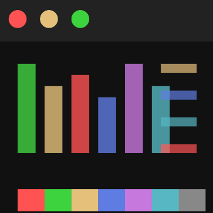

# warp-phenomenon-theme

The theme . . .

  

## Install

To start using the theme with Visual Studio Code copy it into the <user home>/.vscode/extensions folder and restart Code.

## Inspiration

This theme is inspired by Warp's Phenomenon theme.